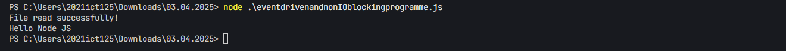
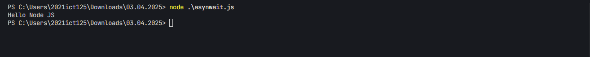
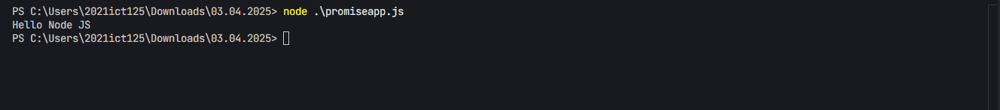

# Node.js Asynchronous Programming Examples

## Event-Driven and Non-I/O Blocking Programming
This example demonstrates event-driven programming by reading a file asynchronously:


## Async/Await Implementation
Using modern async/await syntax for cleaner asynchronous code:


## Promise-Based Implementation
Implementing asynchronous operations using Promises:


## Input File Content
The examples above read from `input.txt` which contains:
```
Hello Node JS
```